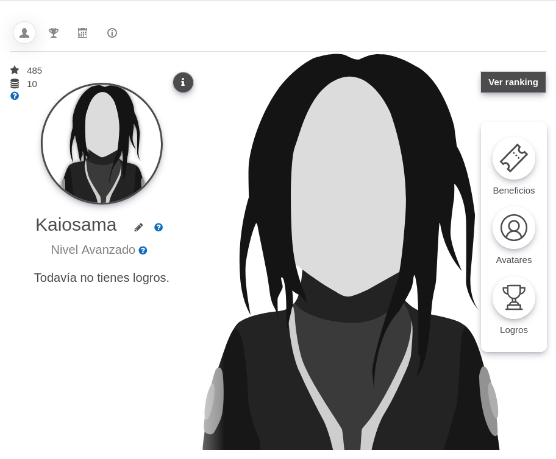

A block to implement a gamification strategy in site level.

Package tested in: 3.11+, 4.0+, 4.1+

## Installing via uploaded ZIP file ##

1. Log in to your Moodle site as an admin and go to _Site administration >
   Plugins > Install plugins_.
2. Upload the ZIP file with the plugin code. You should only be prompted to add
   extra details if your plugin type is not automatically detected.
3. Check the plugin validation report and finish the installation.

## Installing manually ##

The plugin can be also installed by putting the contents of this directory to

    {your/moodle/dirroot}/blocks/ludifica

Afterwards, log in to your Moodle site as an admin and go to _Site administration >
Notifications_ to complete the installation.

Alternatively, you can run

    $ php admin/cli/upgrade.php

to complete the installation from the command line.

## Example avatars ##

Some avatar's package for three levels are delivered by default. To use it you can configure the avatar URLs as follows:

Idea avatar:

    https://ludifica.bambuco.co/avatars/idea/1.png
    https://ludifica.bambuco.co/avatars/idea/2.png
    https://ludifica.bambuco.co/avatars/idea/3.png

Teacher avatar:

    https://ludifica.bambuco.co/avatars/profesor/1-pensar.svg
    https://ludifica.bambuco.co/avatars/profesor/2-preparar.svg
    https://ludifica.bambuco.co/avatars/profesor/3-ensenar.svg

Travel avatar:

    https://ludifica.bambuco.co/avatars/viaje/1-iniciar.svg
    https://ludifica.bambuco.co/avatars/viaje/2-conocer.svg
    https://ludifica.bambuco.co/avatars/viaje/3-recorrer.svg

Additionally, you can download the bust from the following URL:

    https://ludifica.bambuco.co/avatars/idea/bust.png
    https://ludifica.bambuco.co/avatars/profesor/bust.svg
    https://ludifica.bambuco.co/avatars/viaje/bust.svg

These images are delivered under a [Creative commins - Attribution license](https://creativecommons.org/licenses/by/4.0/)
and are based on the resources of: [RutaTIC](https://rutatic.udea.edu.co/crotalus/)

## About ##
- **Developed by:** David Herney - david dot bernal at bambuco dot co
- **GIT:** https://github.com/bambuco/moodle-block_ludifica
- **Documentation:** https://bambuco.co/ludifica/
- **Powered by:** [BambuCo](https://bambuco.co/)

## In version ##
2021031216:
- Default course duration setting. Funded by [Emtelco](https://emtelco.com.co/)

2021031215:
- New setting to show other rankings by user fields. Funded by [Engagement](https://www.engagement.com.co/)

2021031214:
- Setting to use real user information in rankings. Funded by [Engagement](https://www.engagement.com.co/)

2021031213:
- New home URL setting

2021031212:
- Multitenan support

2021031211:
- New default and eliza template
- New setting: hide tabs

2021031208:
Improve criteria to assign badges:
- Implemented "N courses completed" criteria.

2021031207:
- New point allocation criteria: valid / invalid mail change

2021031206:
- Change visualization in not own profile

2021031205:
- New feature: configurable templates

2021031204:
- New points type: new user

2021031203:
- Contextualized help

2021031200:
- First version

## License ##

2023 David Herney @ BambuCo

This program is free software: you can redistribute it and/or modify it under
the terms of the GNU General Public License as published by the Free Software
Foundation, either version 3 of the License, or (at your option) any later
version.

This program is distributed in the hope that it will be useful, but WITHOUT ANY
WARRANTY; without even the implied warranty of MERCHANTABILITY or FITNESS FOR A
PARTICULAR PURPOSE.  See the GNU General Public License for more details.

You should have received a copy of the GNU General Public License along with
this program.  If not, see <https://www.gnu.org/licenses/>.
